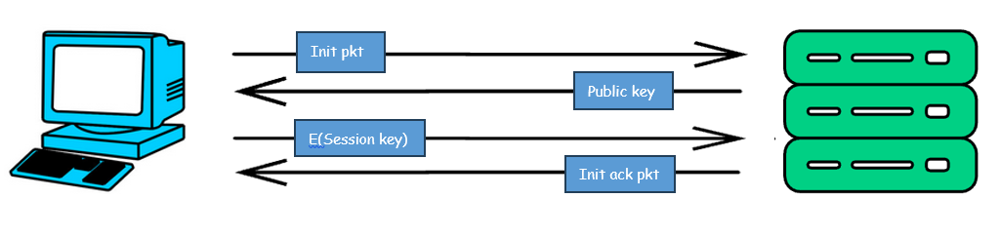

# BinChat


### Description
> BinChat is an encrypted chat application written in C, designed with a modular architecture that makes it easy to extend with new components in the future. It leverages multi-threading for efficient client management, ensuring smooth performance even with multiple active users.

> For security, BinChat uses asymmetric encryption (public-key cryptography) during session key exchange and symmetric encryption (stream/block cipher) for encrypting individual messages, providing both secure key distribution and fast message encryption.


### 🛠️ Tech Stack


### Project File Structure
```c
Binchat/
├── include/
│   ├── globals.h         # Header for global variables
│   ├── main.h            # Header for shared constants
│   ├── libraries.h       # Header for imported c libraries
│   ├── crypto.h          # Header for crypto functions
│   ├── server.h          # Header for server
│   ├── client.h          # Header for client
│   └── utils.h           # Header for utility functions
├── src/
│   ├── server.c          # Server module
│   ├── client.c          # Client module
│   ├── crypto.c          # Source file crypto functions
│   ├── logging.c         # Source file for logging management
│   ├── globals.c         # Source file for initialized global variables
│   └── utils.c           # Source file for utility functions
├── keys/
│   ├── rsa_public.pem    # RSA public key in PEM format
│   └── rsa_private       # RSA private key in PEM format
├── build/
│   ├── server            # Server executable binary
│   └── client            # Cerver executable binary
├── build.sh              # Build script for compiling the project
└── README.md             # Project documentation
```


### Session Establishment Diagram



### How to run
```sh
git clone https://github.com/Avichiii/BinChat.git
cd BinChat
chmod u+x build.sh
./build.sh
```


### Future Improvement
> Currently I don't have a proper logging mechanism. i'll add it in the future.